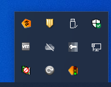
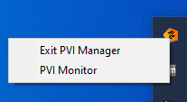
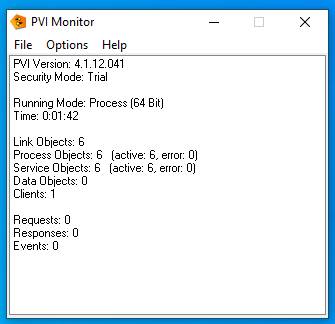
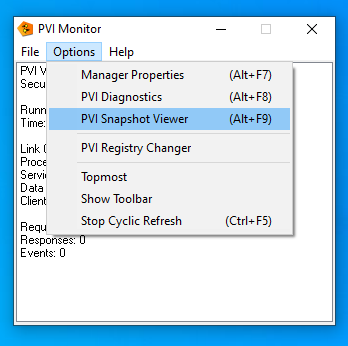
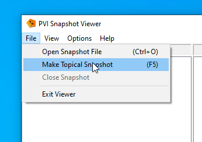
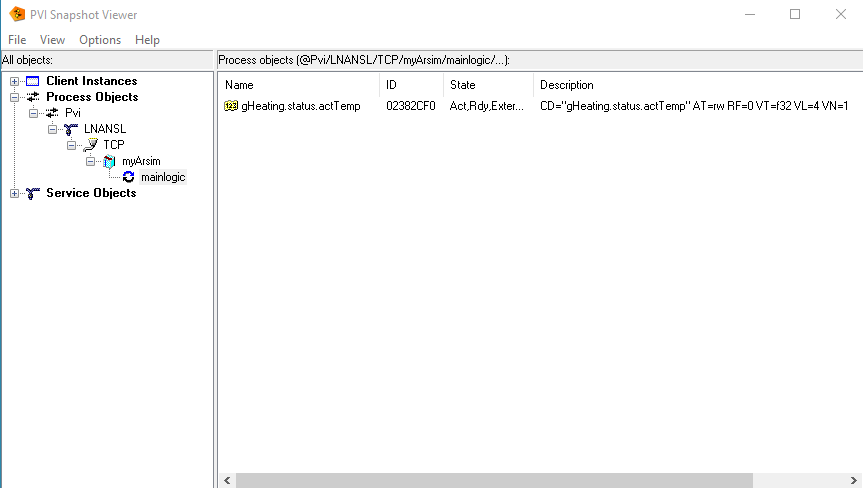

# [PVI- Snapshot](https://help.br-automation.com/#/en/4/automationnet%2Fpvibase%2Fcore%2Fpvidiagnosticssnapshot.htm)

The name says it all: With PVI Snapshot it is possible to take a snapshot of all objects registered in the PVI Manager for diagnostic purposes.

It is then possible to examine all names, properties and statuses of the objects.

## How To Create a PVI Snapshot

### Find PVI Manager Icon in Taskbar

### Open [PVI Monitor](https://help.br-automation.com/#/en/4/automationnet%2Fpvibase%2Fcore%2Fpvimonitor.htm)

Right click to open PVI- Monitor

In PVI- Monitor main view we can see a summary of all created PVI objects including their current statuses:

There are 6 objects ( PVI root, line, device, cpu, task, variable) and fortunately none of them are in fault condition.
We've no valid PVI licence (=Trial) and therefore PVI will stop working in about a quarter of an hour.
There is currently just one client using Pvi Manager.

### [PVI Snapshot Viewer](https://help.br-automation.com/#/en/4/automationnet/pvibase/core/pvimonitordiagnosticssnapshotviewer.htm)

But if we want to see more we have to open the PVI Snapshot Viewer:

At this point, we can either view a previously created snapshot or create a new one that captures the current status.

Now we are able to browse through the entire hierarchical tree of PVI objects and look at each object in detail:

