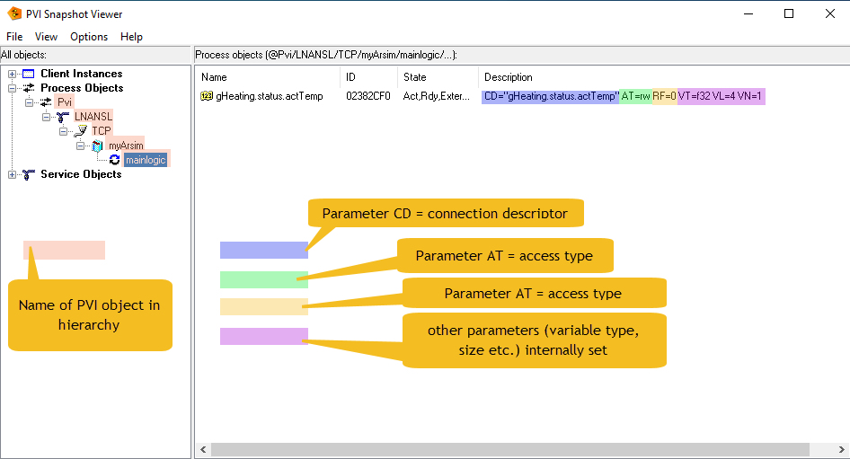

## Defining PVI Objects

Download [simple1.py](https://github.com/hilch/Pvi.py/tree/main/examples/simple1.py) (ANSL).

This simple example just registers a variable, reads its value and then exit after a few seconds.

## Import the library

Initially, only a simple import of the PVI objects is actually necessary:
```
from pvi import *
```

## Establish connection to PVI Manager

Then we first need a connection to the PVI Manager:

```
pviConnection = Connection() # start a Pvi connection
```

It should be noted that this does not establish any connection to the CPU, but only to the 'PVI Manager', a Windows task, which in turn manages all PVI objects and takes care of all communication.

## Define the first PVI object (Line)

We can then set up all PVI objects by instantiating and parameterizing the corresponding Python classes.
Line->Device->Cpu->Task->Variable.

```
line = Line( pviConnection.root, 'LNANSL', CD='LNANSL')
```
The 'Line' determines the protocol used. The currently most important protocol is ANSL, which is mainly used for communication with PLCs.
An older version is called 'INA2000' and is still required if an older PLC with AR < 4.x is to be used.
The 'SNMP' line, which can be used to read and write network parameters, for example, has a completely different meaning. See the corresponding example.

The term 'CD=xxxx' must be specified in exactly the same way and is passed on to the PVI DLL in the same way. For further options, please refer to the PVI documentation.

In fact, we have already defined our first PVI object. All PVI objects are always defined according to the same scheme. 

First of all, the object requires a 'parent'. This is always the first parameter of the PVI object's call constructor. In case of a Line we will have to use the already predefined 'root' objekt ('Pvi').

Secondly, we need a unique name for this object in the hierarchy, which we can freely define. (Well, we are not quite so free in the naming, because only certain characters of the ASCII code are allowed).
In this case, we have named it 'LNANSL'.

This is followed by one or more parameters with which the object can be identified more precisely. In most cases, only the CD parameter is required, although this can also have complex content.
In this case it is simple, we must select the name 'LNANSL' predefined by PVI, which selects the ANSL protocol.


## Choose a network Device

```
device = Device( line, 'TCP', CD='/IF=TcpIp' )
```
The 'Device' defines the hardware interface to be used. Only 'TcpIp' is actually possible for ANSL. This is used to establish the connection via Ethernet interface, loop-back adapter or also via Wifi.
INA2000 is also able to communicate via serial interface or CAN interface.

## Connect to the PLC

```
cpu = Cpu( device, 'myArsim', CD='/IP=127.0.0.1' )
```
Finally, the 'Cpu' is the object that represents the connection to the correct PLC. Depending on which 'Device' is used, corresponding parameters are required for the CPU. Please refer to the PVI documentation if necessary.

At this point, we could already carry out useful actions with the CPU, e.g. trigger a warm start or read out the status of the CPU or much more.

## Connect to Tasks and Variables

However, we would like to read out a local variable of the CPU at this point. Global variables should be created hierarchically below the 'CPU' object. 
However, local variables are always part of a task. So we have to take care of this first. The name of the task on the PLC must again be specified.
```
task1 = Task( cpu, 'mainlogic')
```
A 'Task' also has useful options, e.g. it can be stopped and restarted at runtime, which we do not intend to do here.

Now we can finally create a 'Variable' object that allows us to access the properties of the corresponding PLC variables.
```
temperature = Variable( task1, 'gHeating.status.actTemp' )
```
We could now access the '.value' property of the variable object cyclically in order to read the value of the variable. However, this would not be very resource-efficient. PVI is able to work in an event-driven manner. We therefore let it inform us of a value change and pass a callback function that also informs us of the value:
```
temperature.valueChanged = lambda value : print(f'{temperature.name} = {value}')
```

## Start the PVI event loop

Now we need to breathe some life into the PVI functions in the background. 
A
```
pviConnection.start() # call it once
```
would be absolutely sufficient for this job. As in a classic Windows program, an infinite loop is created internally that cyclically calls the 'doEvents()' function of the 'Connection'.
So

```
while True:
    pviConnection.doEvents() # must be cyclically called
```
would do the same (and could sometimes be the simpler solution). But the loop started with 'start()' already contains a break condition that can be set by 'stop()'.

Since life is not endless, our program should not run indefinitely and end cleanly.
For this we create a monitoring function that calls the '.stop()' member of the Connection after a certain time. This ends the loop and ultimately the entire script.
```
def runtimeMonitor( init : bool ):
    if datetime.datetime.now() - startTime > datetime.timedelta(seconds = 10):
        print("done !")
        pviConnection.stop() # exit
```

This function is also given a parameter which is 'True' when it is called for the first time. This allows us to perform initializations within the function. All further calls are carried out with 'False' as an argument.

We change the start of the connection only slightly:

```
pviConnection.start( runtimeMonitor ) # call it once
```

Are we finished now ? Not quite yet.
In case the CPU was not available we would not get aware of this. Thus we add another callback function to monitor the connection to CPU.

```
def cpuErrorChanged( error : int ):

    if error != 0:
        raise PviError(error)

cpu.errorChanged = cpuErrorChanged
```
## Test
Open the console (e.g. cmd)
Starting the script by
```
py simple1.py
```
should end in 
```
@Pvi/LNANSL/TCP/myArsim/mainlogic/gHeating.status.actTemp = 20.0
done !
```

To check which objects our script has registered with the PVI Manager and whether the parameters used were correct, we can use the [PVI snapshot](../diagnosis/snapshot/snapshot.md). And this is definitely a good way to train your understanding of how PVI works in principle.

The entire script should now be automatically terminated after 10 seconds. This is a little too short to examine it more closely. 
Change the timeout from 10 s to e.g. 120 s (= 2 min) and start it again.

```
if datetime.datetime.now() - startTime > datetime.timedelta(seconds = 120):
```

A successful snapshot should show this:


