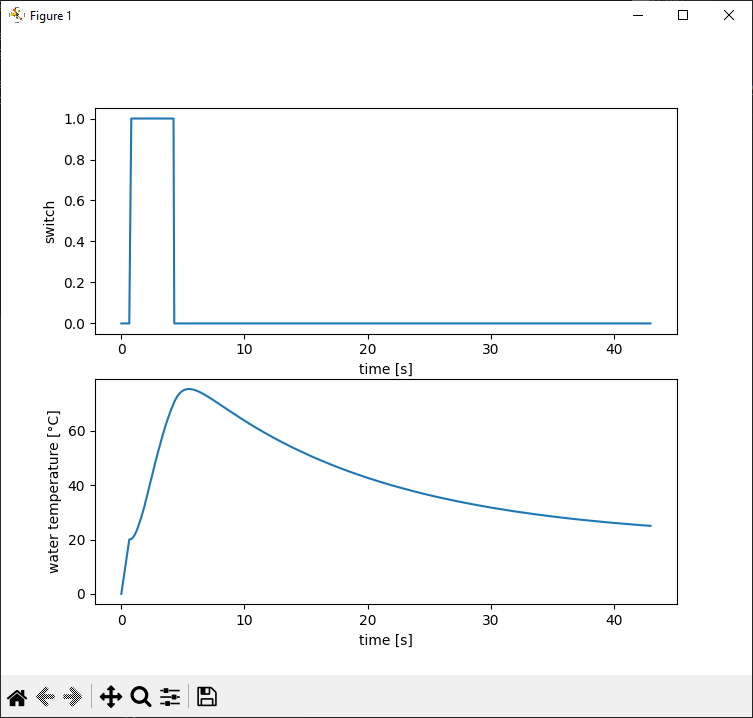

once you have the process data in the Python world, you can use other ingenious libraries to get even more functionality out of it. 

In this case, we will plot the temperature curve with [matplotlib](https://matplotlib.org/).

In order to use matplotlib, you must first install it. This can be done as usual via pip

```
pip install matplotlib
```

There are some [great tutorials](https://matplotlib.org/stable/users/explain/quick_start.html#quick-start) on their web page how to start.

## Extend the script

Download [simple4.py](https://github.com/hilch/Pvi.py/tree/main/examples/simple4.py) (ANSL)


First we import the plot routines from matplotlib with 'plt' as alias.
We also need some time functions and will get them from builtin datetime library.

```
import matplotlib.pyplot as plt
import datetime
```

Then let's start some list for holding the data to be traced

```
trace = {
    'time' : [0.0],
    'temp' : [0.0],
    'switch' : [0]
}
```

We now now save the starting time of the script since we would like to start with 0 seconds in the plot.

```
startTime = datetime.datetime.now()
```

Then we collect the error events for our two most important objects in just one callback function (in the hope that it will never be called).

```
def errorChanged( error : int ):

    if error != 0:
        raise PviError(error )

cpu.errorChanged = errorChanged
temperature.errorChanged = errorChanged
```

Now we need a function that appends all new process values to our lists. 
The timestamp is always converted to the start time of the script.

```
def temperatureChanged( value : float ):
    t = datetime.datetime.now() - startTime

    print(f'\rTemperature = {round(value,1)}', end="")
    trace['time'].append( t.seconds + t.microseconds / 1e6 )
    trace['temp'].append( value )
    trace['switch'].append( switch.value )
```

This new callback function must now be reconnected to the temperature variable. 
We have of course removed the previous simple lambda expression at the beginning of the script.

```
temperature.valueChanged = temperatureChanged
```

When the coffee machine has cooled down again, we display the temperature curve in a separate window.

To do this, we define two subplots, label the axes and transfer the X/Y values for each of these axes.

```
    plt.subplot(2,1,1)
    plt.plot( trace['time'], trace['switch'] )
    plt.xlabel("time [s]")
    plt.ylabel("switch")

    plt.subplot(2,1,2)
    plt.plot( trace['time'], trace['temp'] )
    plt.xlabel("time [s]")
    plt.ylabel("water temperature [°C]")
    plt.show()
```

That's it.


## Test
Open the console (e.g. cmd)
Starting the script by
```
py simple4.py
```
lets the script run for a few seconds and will end in a view like this:

```
Temperature = 20.0
warming up...

Temperature = 69.5
cooling down...

Temperature = 25.0
it's cool guys !
```

After the run a new window pops up and shows the traces:



Small restriction: You should also bear in mind that PVI does not provide real-time data.

If this is really needed, then the values must be recorded on the PLC.